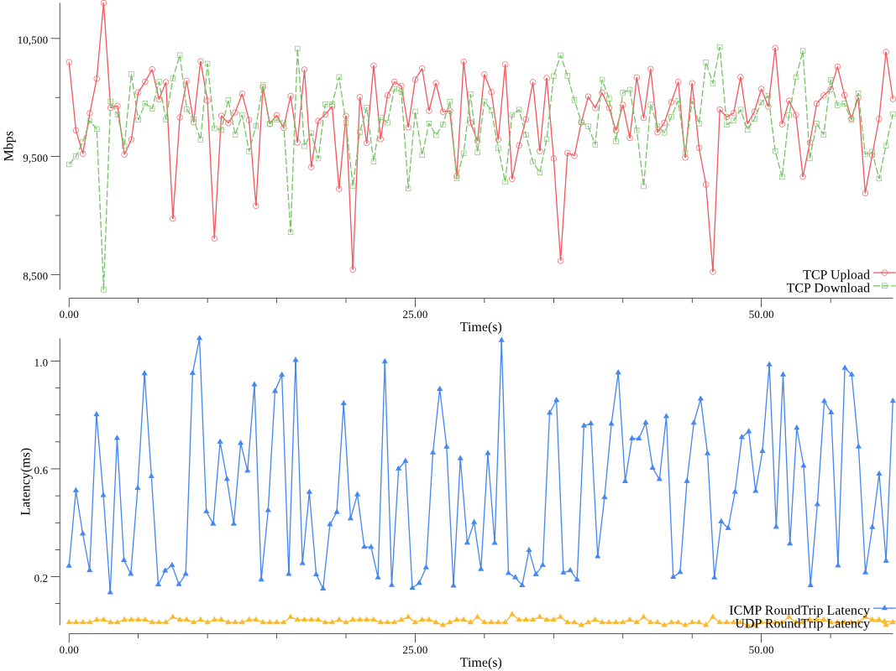

# automata

A network performance testing and visualization tool based on netperf and RRUL(Real-Time Response Under Load)

## Why
Inspired by [Flent](https://flent.org/index.html), it is nice to have a network performance testing and visualization tool with time series data. This tool is intended to solve below problems of flent:
* Complexity of parameters and configurations
* Many ports and protocols needs to be opened

This tool is easy to use and only requires `netperf` ports (12865/tcp, 12866/tcp, 12866/udp) to be opened so can be easily integrated with firewall environment or Micro Services Architecture

## Output example
This is an example of RRUL testing result on localhost:

## How

Below are quick start instructions

#### Requirements
netperf with demo feature enabled (`–enable-demo=yes`)

	apt-get update && apt-get install net-perf

#### Build binary
	make
#### On Server
	netserver
#### On Client
	./build/automata -host <Server_Address> -o result.png
#### Client usage
	Usage of ./build/automata:
	  -P uint
	    	netserver data port (default 12866)
	  -host string
	    	netserver address e.g "192.168.100.100" (default "127.0.0.1")
	  -l uint
	    	time in seconds the test will last (default 30)
	  -o string
	    	output filename of plotting, print csv data if not provided
	  -p uint
	    	netserver control port (default 12865)
#### Docker, Kubernetes and Istio
A netperf netserver image can be pulled from:

	docker pull ksang/netserver

Example of using this image with kubernetes and istio:

netserver.yaml:

	apiVersion: v1
	kind: Service
	metadata:
	  name: netserver
	  labels:
	    app: netserver
	spec:
	  ports:
	  - name: netservertcp12865
	    protocol: TCP
	    port: 12865
	    targetPort: 12865
	  - name: netservertcp12866
	    protocol: TCP
	    port: 12866
	    targetPort: 12866
	  - name: netserverudp12866
	    protocol: UDP
	    port: 12866
	    targetPort: 12866
	  selector:
	    app: netserver
	---
	apiVersion: extensions/v1beta1
	kind: Deployment
	metadata:
	  name: netserver-v1
	spec:
	  replicas: 1
	  template:
	    metadata:
	      labels:
	        app: netserver
	        version: v1
	    spec:
	      containers:
	      - name: netserver
	        image: ksang/netserver
	        imagePullPolicy: IfNotPresent
	        ports:
	        - containerPort: 12865
	          protocol: TCP
	        - containerPort: 12866
	          protocol: TCP
	        - containerPort: 12866
	          protocol: UDP
